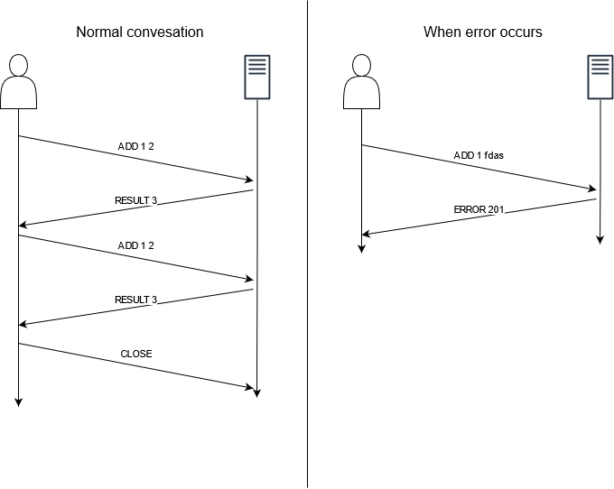

# Protocol specification
## What transport protocol do we use?
Our protocole will use TCP as tranport protocole (??)

## How does the client find the server (addresses and ports)?
Our client has to be on the same local network that the server and so the server will be reached with its local ip address.
The port will be 1234. 

## Who speaks first?
Since the server will be running indefinitely. The client has to speak first. 

## What is the sequence of messages exchanged by the client and the server? (flow)

Errors:
    100. unknwon operation
    200. bad 1st parameter
    201. bad 2nd parameter
    300. missing second parameter

## What happens when a message is received from the other party? (semantics)
[pas compris]

## What is the syntax of the messages? How we generate and parse them? (syntax)
A message should finish by a end line char. The party then will split the message where space is. The first part of the message should be a keyword. The rest should be the "parameters" for this keyword.

## Who closes the connection and when?
it's closed by the server when it send the result or the error.

